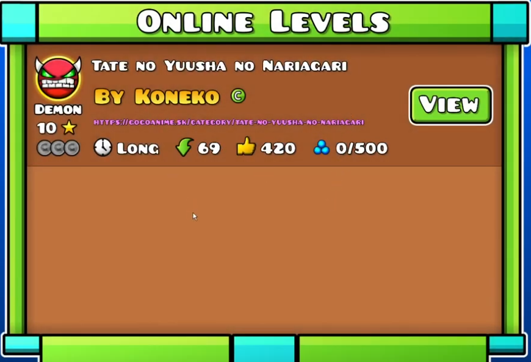

# gd-anime-ps 
otherwise known as [geometry dash anime searching private server](https://github.com/koneko/gd-anime-ps)  
this server is kinda just a proof of concept that scrapes gogoanime  
and its pretty complicated to figure it out but it works as demonstrated in [this video](https://www.youtube.com/watch?v=mLuIbxNoO-U)  
there is also more functionality for users and stuff (check the source code lol) and its the same thing  

## Usage
1. clone or download the repo
2. have node installed
3. `npm i` in the root of the repo
4. run `node encode.js` to get the base64 encoded strings that you gonna replace
5. and to **start the server run the command** `node .`
6. download and launch [HxD](https://mh-nexus.de/en/downloads.php?product=HxD20)
7. open GeometryDash.exe in it (use CTRL+F to search and CTRL+R to search and replace)
8. use the values from encode.js to search and replace all the strings in HxD
9. save and open geometry dash
10. if you did it all correct, GD should launch with no errors and if you go to search an anime name in the search box, it should show just like in the video mentioned above
11. enjoy!!!!1!!1!!